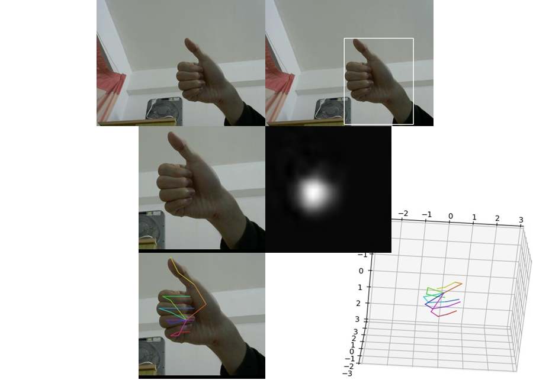

3D hand pose estimation.



## Dependencies

matplotlib==2.1.1

numpy==1.13.3

opencv-python==3.3.0.10

Pillow==4.3.0

scipy==1.0.0

tensorflow-gpu==1.4.0

## Datasets

1. Download & Extract [EgoHands](http://vision.soic.indiana.edu/projects/egohands/) into `data/E/`.

2. Download & Extract [Rendered Handpose Dataset](https://lmb.informatik.uni-freiburg.de/resources/datasets/RenderedHandposeDataset.en.html) into `data/R/`.

3. Download & Extract [Stereo Handpose Dataset](https://sites.google.com/site/zhjw1988/) into `data/S/`.

4. Download [RWTH German Fingerspelling Database](http://www-i6.informatik.rwth-aachen.de/~dreuw/fingerspelling.php) into `data/T/`.

5. Make sure nothing is wrong.

  ```
  $ tree -L 2 data/
  data
  ├── demo_E.py
  ├── demo_R.py
  ├── demo_S.py
  ├── E
  │   ├── _LABELLED_SAMPLES
  │   ├── DEMO_1.m
  │   ├── DEMO_2.m
  │   ├── getBoundingBoxes.m
  │   ├── getFramePath.m
  │   ├── getMetaBy.m
  │   ├── getSegmentationMask.m
  │   ├── metadata.mat
  │   ├── README.txt
  │   └── showLabelsOnFrame.m
  ├── R
  │   ├── evaluation
  │   ├── README
  │   ├── training
  │   ├── view_samples.m
  │   └── view_samples.py
  ├── S
  │   ├── images
  │   ├── labels
  │   └── readme.txt
  └── T
      ├── i6_data_P20_BOTH.txt
      ├── i6_data_P20_SESSION_1.txt
      ├── i6_data_P20_SESSION_2.txt
      ├── scripts
      └── video
  ```

## Training & Evaluating

```
$ export PYTHONPATH=$(pwd):${PYTHONPATH}
```

### Hand Detection

Working directory is `hand_detection/`.

```
export PYTHONPATH=$(pwd)/tensorflow_object_detection_API/object_detection:$(pwd)/tensorflow_object_detection_API/slim:${PYTHONPATH}
```

* Prepare

  ```
  # Generate tfrecords
  $ python gen_tfrecord.py --num_examples 15000 --percentage_train 0.7 R
  $ python gen_tfrecord.py --resize 640 360 E
  ```

* Train & Eval using dataset R

  Download & Extract the pretrained SSD model [ssd_mobilenet_v1_coco](http://download.tensorflow.org/models/object_detection/ssd_mobilenet_v1_coco_2017_11_17.tar.gz) into `__model/`.

  ```
  $ python -m object_detection.train --logtostderr --train_dir=__train --pipeline_config_path=pipeline_R.config
  ```

  ```
  $ python -m object_detection.eval --logtostderr --checkpoint_dir=__train --eval_dir=__eval --pipeline_config_path=pipeline_R.config
  ```

  ```
  $ tensorboard --logdir .
  ```

* Train & Eval using dataset E

  ```
  $ rm __train/* __eval/* __model/*

  # Choose a checkpoint, e.g. 69027
  # Rename: __train/model.ckpt-69027.* -> __model/model.ckpt.*
  ```
  ```
  $ python -m object_detection.train --logtostderr --train_dir=__train --pipeline_config_path=pipeline_E.config
  ```

  ```
  $ python -m object_detection.eval --logtostderr --checkpoint_dir=__train --eval_dir=__eval --pipeline_config_path=pipeline_E.config
  ```

  ```
  $ tensorboard --logdir .
  ```

* Export the graph

  ```
  # Choose a checkpoint, e.g. 23954
  $ python -m object_detection.export_inference_graph --input_type=image_tensor --pipeline_config_path=pipeline_E.config --trained_checkpoint_prefix=__train/model.ckpt-23954 --output_directory=__train/exported_graphs
  ```

### Key Points Estimation

Working directory is `key_points_estimation/`.

* Prepare

  ```
  # Generate tfrecords
  $ python gen_tfrecord.py --percentage_train 0.938 R
  $ python gen_tfrecord.py --resize 320 240 --percentage_train 0.833 S
  ```

* Train & Eval

  Download the pretrained CPM (Convolutional Pose Machine) model [CPM_MPII](https://pan.baidu.com/s/1e03YSWf9wiK5RScwFHGmdA) into `__model/`.

  ```
  $ python train.py
  $ python eval.py
  $ tensorboard --logdir .
  ```

### Pose Estimation

Working directory is `pose_estimation/`.

* Train & Eval

  ```
  $ python train.py
  ```

  ```
  $ python eval.py
  ```

  ```
  $ tensorboard --logdir .
  ```

### Fingerspelling Recognition

Working directory is `fingerspelling_recognition/`.

* Prepare

  ```
  # Generate tfrecords
  $ python gen_tfrecord.py
  ```

* Train & Eval

  ```
  $ python train.py
  $ python eval.py
  $ tensorboard --logdir .
  ```

## Testing

Working directory is `test/`.

* Prepare

  Modify `config.py`.

* Test

  ```
  $ python run.py
  ```


